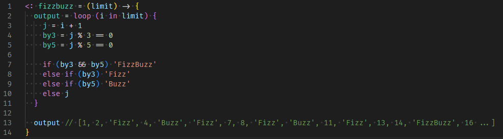

# Sourscript language support

## Features

Only syntax highlight for now, but code completion and error handling are planned.

## Release Notes

### 0.1.0

Initial release
Added syntax highligh support
